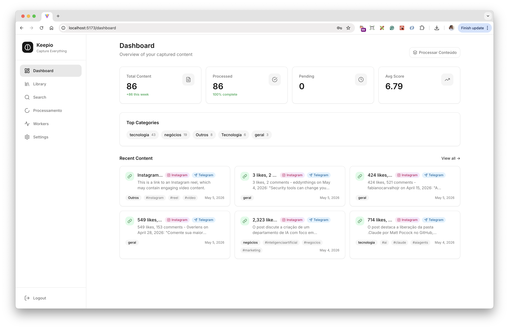

# Keepiu

**Personal AI Vault — Capture, process and search your content automatically.**



Keepiu is a self-hosted tool that turns everything you send — links, images, audio, video, Instagram posts — into structured, searchable knowledge. Forward content from Telegram or WhatsApp and get back summaries, tags, transcriptions, and semantic search, all stored privately on your own infrastructure.

---

## What is Keepiu?

Most people accumulate content they never revisit: articles saved for later, voice messages with important info, screenshots of posts worth keeping. Keepiu captures all of that, processes it with AI, and makes it retrievable.

It works as an automated second brain:

- **Send content** via Telegram bot, WhatsApp, or the web UI
- **AI processes it** — extracts text, transcribes audio, summarizes, tags
- **Search it** semantically — find what you saved even if you don't remember the exact words

---

## How it works

```
Telegram / WhatsApp
         ↓
   Receive content
         ↓
  OCR (images) / STT (audio & video)
         ↓
  AI analysis (summary, tags, sentiment, CTA)
         ↓
  Store in PostgreSQL + pgvector
         ↓
  Semantic search & dashboard
```

---

## Features

### Ingestion
- **Telegram bot** — send text, links, images, audio, video, or forwarded messages
- **WhatsApp** — receive content via WhatsApp Business API webhook

### Processing
- **OCR** — extract text from images using Tesseract
- **Audio & video transcription** — Speech-to-Text via OpenAI (`gpt-4o-mini-transcribe`)
- **Instagram intelligence** — capture public posts, extract captions, run OCR on carousel slides, and analyze tone, niche, CTA, and sentiment
- **AI analysis** — summarize, categorize, tag, and score every piece of content using OpenAI
- **Reprocessing** — re-run AI analysis on any saved content from the detail view

### Storage & Search
- **PostgreSQL 16 + pgvector** — structured storage with semantic vector embeddings
- **Semantic search** — find content by meaning, not just keywords
- **Dashboard** — overview of stats, recent content, and top categories

### Infrastructure
- **Async pipeline** — Celery + Redis for background processing
- **Inline mode** — run without Redis for single-instance deployments
- **Docker Compose** — single command to start everything
- **Flower** — task monitoring UI included

---

## Bots as the primary interface

The Telegram and WhatsApp bots are the fastest way to capture content on mobile. No app to open — just forward a message and Keepiu handles the rest.

- Share a YouTube link → get a summary and tags
- Send a voice message → get a transcript and key points
- Forward an Instagram post URL → get OCR, caption analysis, and sentiment
- Send a screenshot → get extracted text and categorization

---

## Quick Start

**Prerequisites:** Docker Desktop, OpenAI API key, and optionally a Telegram bot token.

```bash
git clone https://github.com/your-org/keepiu.git
cd keepiu
cp .env.example .env
```

Edit `.env` with your credentials (see [Configuration](#configuration) below), then:

```bash
docker compose up -d
```

This starts:
- PostgreSQL 16 with pgvector
- Redis
- FastAPI backend — `http://localhost:8000`
- Celery worker + Flower (`http://localhost:5555`)
- React frontend — `http://localhost:5173`
- Landing page — `http://localhost:5174`

Open `http://localhost:5173` and log in with the password you set in `APP_PASSWORD`.

The landing page at `http://localhost:5174` is a static SPA (Next.js → nginx) and runs independently from the backend.

---

## Configuration

Key variables in `.env`:

```env
# Required
OPENAI_API_KEY=sk-...
JWT_SECRET=change-this-to-a-random-string
SESSION_SECRET=change-this-to-a-random-string

# App mode
APP_MODE=single_user          # single_user | multi_user
APP_PASSWORD=your-password    # used when APP_MODE=single_user

# Telegram (optional — configure via Settings UI instead)
TELEGRAM_BOT_TOKEN=
TELEGRAM_WEBHOOK_SECRET=

# WhatsApp (optional — configure via Settings UI instead)
WHATSAPP_VERIFY_TOKEN=
WHATSAPP_ACCESS_TOKEN=
WHATSAPP_PHONE_NUMBER_ID=
WHATSAPP_APP_SECRET=

# Processing mode
PROCESSING_MODE=worker        # worker | inline (no Redis required)

# Encryption key for secrets stored in DB
# python3 -c "from cryptography.fernet import Fernet; print(Fernet.generate_key().decode())"
SETTINGS_ENCRYPTION_KEY=
```

All integration keys (Telegram, WhatsApp, OpenAI) can also be set through the **Settings** page in the dashboard without restarting the application.

---

## Authentication

Keepiu supports two modes:

| Mode | Description |
|------|-------------|
| `single_user` | One shared password. Session stored in a secure httpOnly cookie. Ideal for personal use. |
| `multi_user` | Each Telegram/WhatsApp user gets their own account. Admin promoted via `INITIAL_ADMIN_USERNAME`. |

---

## Project Structure

```
keepiu/
├── apps/
│   ├── backend/
│   │   ├── app/
│   │   │   ├── api/           # FastAPI route handlers
│   │   │   ├── core/          # Config, database, security
│   │   │   ├── models/        # SQLAlchemy ORM models
│   │   │   ├── schemas/       # Pydantic request/response schemas
│   │   │   ├── services/      # Business logic (AI, ingestion, Instagram, settings)
│   │   │   ├── workers/       # Celery tasks (content, audio, Instagram, WhatsApp)
│   │   │   └── utils/         # OCR, audio extraction, transcription, link parsing
│   │   └── migrations/        # Alembic database migrations
│   └── frontend/
│       └── src/
│           ├── components/    # Shared UI components
│           ├── pages/         # Route-level pages (Dashboard, Library, ContentDetail, Settings)
│           ├── hooks/         # React Query data hooks
│           ├── services/      # API client
│           └── store/         # Zustand auth state
├── docker-compose.yml
├── docker-compose.prod.yml
└── .env.example
```

---

## Roadmap

### In progress / next
- **LinkedIn content capture** — public posts, text extraction, professional content analysis
- **Granular reprocessing** — choose which pipeline stages to re-run (OCR only, AI only, etc.)
- **Pipeline observability** — per-task metrics and error details in the dashboard

### Planned
- Browser extension for one-click capture from any webpage
- Mobile-optimized dashboard view
- Export to Notion / Obsidian / JSON
- Scheduled digests (daily/weekly summaries by email or Telegram)

---

## Contributing

### Getting started

1. Fork the repository
2. Create a feature branch:
   ```bash
   git checkout -b feature/your-feature-name
   ```
3. Make your changes following the existing code style
4. Open a Pull Request with a clear description of what changed and why

### Guidelines

- Keep the processing pipeline intact — new content types should follow the existing worker pattern (`bind=True` Celery task with stage tracking)
- Backend changes that touch the database need an Alembic migration
- Frontend components should use the existing `Card`, `LoadingSpinner`, and React Query hooks
- Add tests where the logic is non-trivial
- Describe your PR clearly — what it does, what it doesn't do, and how to test it

### Reporting issues

Use GitHub Issues. Include:
- Steps to reproduce
- Expected vs actual behavior
- Relevant logs (check `docker compose logs worker` for processing errors)

---

## Tech Stack

| Layer | Technology |
|-------|-----------|
| Backend | FastAPI, Python 3.12, SQLAlchemy, Alembic |
| Database | PostgreSQL 16, pgvector |
| Queue | Celery, Redis |
| AI | OpenAI (GPT-4o, Whisper STT, embeddings) |
| OCR | Tesseract, ffmpeg |
| Browser automation | Playwright (Instagram capture) |
| Frontend | React 18, TypeScript, Vite, TailwindCSS, React Query, Zustand |
| Infrastructure | Docker, Docker Compose |

---

## License

MIT — free to use, modify, and self-host.
